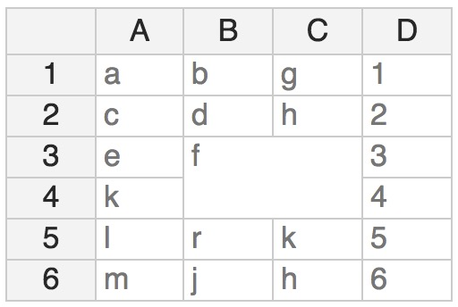

# sphinxcontrib-excel-table

The sphinxcontrib-excel-table extension is to render an excel file as an excel-alike table in Sphinx documentation.

This contrib is inspired by sphinxcontrib-excel, which uses pyexcel and handsontable to do the
work, but the sphinxcontrib-excel-table will instead use openpyxl and handsontable, mainly to
support the following features:

* merged cell
* display specific sheet
* display specific section in one sheet
* display specific rows in one sheet

## Installation

You can install it via pip:

```
$ pip install sphinxcontrib-excel-table
```

or install it from source code:

```
$ git clone https://github.com/hackerain/sphinxcontrib-excel-table.git
$ cd sphinxcontrib-excel-table
$ python setup.py install
```

## Setup

Add sphinxcontrib.excel_table to your conf.py file:

```
extensions = ['sphinxcontrib.excel_table']
```

And you will need to copy a few resource files to your sphinx source directory:

```
resources/_templates/layout.html
resources/_static/handsontable.full.min.js
resources/_static/handsontable.full.min.css
```

## Usage

Here is the syntax to present your excel file in sphinx documentation:

```
.. excel-table::
   :file: path/to/file.xlsx
```

This will translate to:



As you can see, it supports merged cells, and this is the mainly goal this contrib will achieve, because other sphinxcontrib excel extensions don't support this feature, and are not convenient to implement it. The sphinxcontrib-excel-table can to this easily using openpyxl library.

## Options

This sphinxcontrib provides the following options:

**file (required)**

Relative path (based on document) to excel documentation. Note that as openpyxl only supports excel xlsx/xlsm/xltx/xltm files, so this contrib doesn't support other old excel file formats like xls.

```
.. excel-table::
   :file: path/to/file.xlsx
```

**sheet (optional)**

Specify the name of the sheet to dispaly, if not given, it will default to the first sheet in the excel file.

```
.. excel-table::
   :file: path/to/file.xlsx
   :sheet: Sheet2
```

Note this contrib can only display one sheet in one excel-table directive, but you can display different sheet in one excel in different directives.

**rows (optional)**

Specify the row range of one sheet do display, the default is to display all rows in one sheet, if you use this option, remember to specify a range seperated by a colon.

```
.. excel-table::
   :file: path/to/file.xlsx
   :rows: 1:10
```

**selection (optional)**

Selection defines from and to the selection reaches. If value is not defined, the whole data from sheet is taken into table. And if selection is used, it must specify the from and to range seperated by a colon.

```
.. excel-table::
   :file: path/to/file.xlsx
   :selection: A1:D10
```

**overflow (optional)**

Prevents table to overlap outside the parent element. If 'horizontal' option is chosen then table will appear horizontal
scrollbar in case where parent's width is narrower then table's width. The default is 'horizontal', if you want to disable this feature, you can set false to this option.

```
.. excel-table::
   :file: path/to/file.xlsx
   :overflow: false
```

**colwidths (optional)**

Defines column widths in pixels. Accepts number, string (that will be converted to a number),
array of numbers (if you want to define column width separately for each column) or a
function (if you want to set column width dynamically on each render). The default value is undefined, means the width will be determined by the parent elements.

```
.. excel-table::
   :file: path/to/file.xlsx
   :colwidths: 100
```
